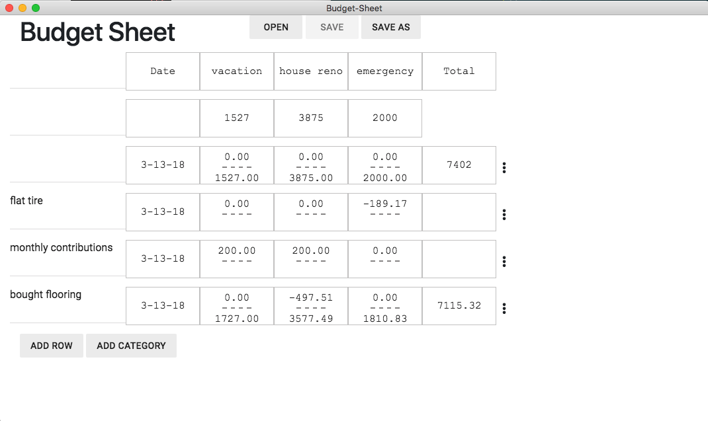

# Budget Sheet



A very simple ledger sheet. It's intended use-case is to split a single savings account into multiple categories and track their amounts.

## Set Up

```
npm i
npm run dev
```

`npm run dev` will launch the app in developer mode. If any changes are made to the source files, the app will automatically reload.

## Build

  - `npm run build:linux`
  - `npm run build:win32`
  - `npm run build:mas`
  - `npm run build:darwin`
  - or `npm run build` to build everything

## Tech Stack

This project primarily depends on [Vue](https://vuejs.org/v2/guide/), [Vuex](https://vuex.vuejs.org/en/intro.html), and [Keen-UI](https://josephuspaye.github.io/Keen-UI/#/ui-alert).

### Vue

Vue (pronounced "view") is what's called a view library. It binds the UI to the code/data that drives it. Vue does this in a declarative manner. What this means is that the programmer says "draw these parts of the UI based on this information". Vue automatically detects when the information changes and automatically updates the UI. This removes all the burden of updating the UI from the programmer.

### Vuex

Vuex ("view X") is a state-management library designed to integrate with Vue. Vuex can contain all of an application's shared information (information used in more than one place) in a central location called a store. This could get really mess, because any part of the program could change the information for any other part. To prevent this, the store can only be changed by tightly-controlled functions called actions.

The advantages of a store are:

  1. Information doesn't have to be duplicated across the program. Every part of the program can use the "master copy" / source-of-truth.
  1. All of the application's state is in one (organized) place, making it easier for the developer to think about.
  1. Any part of the application (especially the UI) can readily access any information it needs in a direct manner.
  1. Because the changes to the information are tightly controlled and traceable, it helps to eliminate all the kinds of bugs where "something changed and I don't know why" and some of the bugs where "something didn't change and it should have."
  1. Because any part of the application has access to the actions, it makes it easier to trigger changes from the places that make the most sense.

### Keen UI

A simple collection of UI components (buttons, checkboxes, sliders, etc.) designed to be used with Vue. I chose it because it's very lightweight.

## TODO

  - Implement remove row and remove category
  - ...
